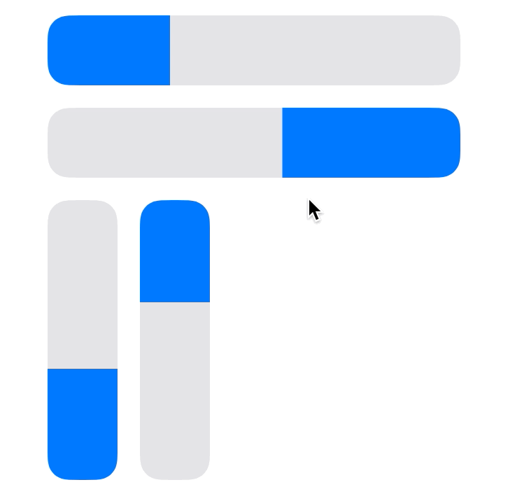
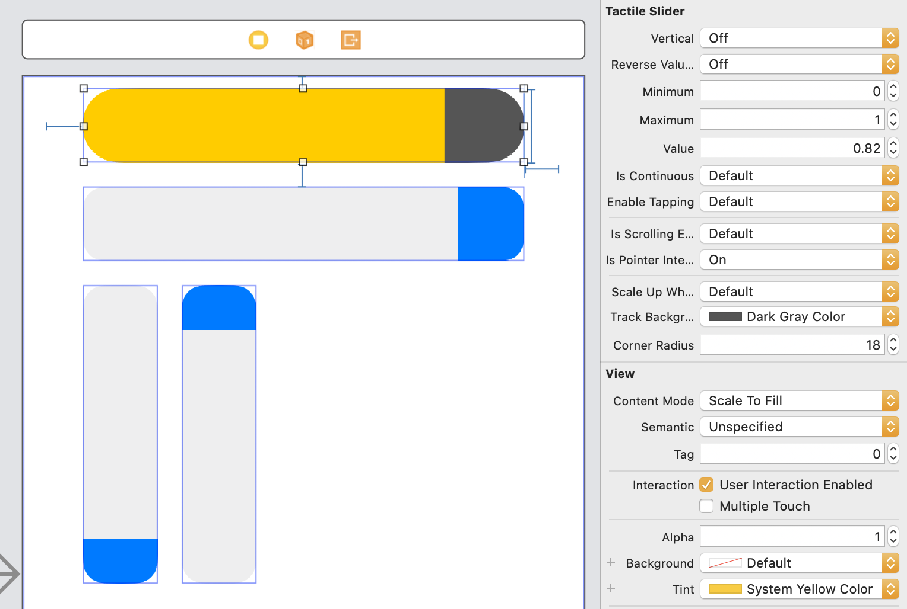

# TactileSlider

[](https://travis-ci.org/daprice/iOS-Tactile-Slider)
[](https://cocoapods.org/pods/TactileSlider)
[](https://cocoapods.org/pods/TactileSlider)
[](https://cocoapods.org/pods/TactileSlider)

A slider control designed to be easy to grab and use because it can be dragged or tapped from anywhere along its track, similar to the sliders in Control Center and HomeKit.



## Features

- Can be dragged or (optionally) tapped to set a value
- Supports horizontal and vertical orientation in either direction
- IBDesignable – colors, values, rounded corners, and behavior can be customized in Interface Builder or programatically
- Supports light & dark appearance using semantic system colors by default (iOS 13+)
- Adjustable haptic feedback (iOS 10+)
- VoiceOver support
- Supports pointer (e.g. trackpad or mouse) based scrolling on iPadOS (iOS 13.4+)

## Example

To run the example project, clone the repo, and run `pod install` from the Example directory first.

## Requirements

iOS 8.0+

- iOS 10.0+ required for haptic feedback
- iPadOS 13.4+ required for pointer use

## Installation

TactileSlider is available as a Swift package or through [CocoaPods](https://cocoapods.org).

To install it using CocoaPods, simply add the following line to your Podfile:

```ruby
pod 'TactileSlider'
```

## Usage

```swift
let slider = TactileSlider(frame: someRect)

slider.minimumValue = 1
slider.maximumValue = 10

slider.setValue(3.8, animated: true)
```

### Setting orientation and direction

```swift
slider.vertical = true
slider.reverseValueAxis = true
```

### Adjusting behavior

```swift
slider.isContinuous = false
slider.enableTapping = false // allow or disallow tapping anywhere on the slider track to instantly set a value
slider.feedbackStyle = .medium // customize haptic feedback
slider.isScrollingEnabled = false // allow or disallow scrolling to adjust the slider using a connected pointing device on iPadOS
```

### Changing colors and appearance

```swift
slider.trackBackground = UIColor.black.withAlpha(0.8) // use translucent black for the slider track
slider.tintColor = UIColor.systemGreen // use dynamic green for the slider thumb
slider.cornerRadius = 12
slider.isPointerInteractionEnabled = true // display a hover effect when under the pointer on iPadOS
```

### Interface Builder



## Author

Dale Price ([@dale_price@mastodon.technology](https://mastodon.technology/@dale_price))

## License

TactileSlider is available under the MIT license. See the LICENSE file for more info.
